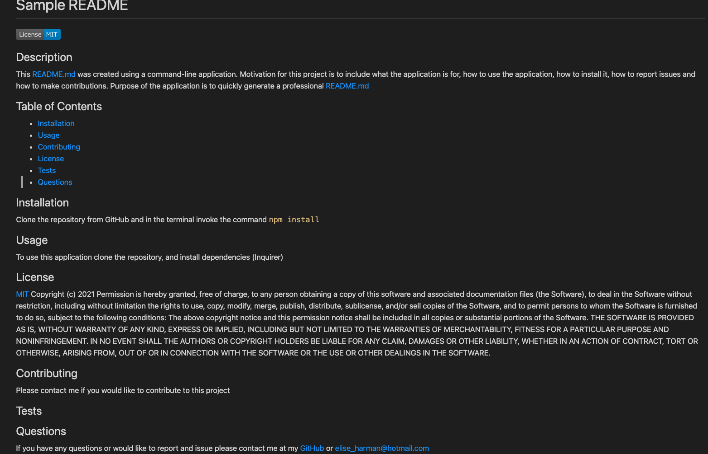

# Sample README
  
  
  ## Description 
  This command-line application dynamically creates a professional README.md file from a user’s input using the Inquirer package.  The motivation for building this application was to bring consistency to README.md file’s for applications.  The purpose is to reduce the amount of time spent creating a README.md so project creators can devote more time to working on a project. 
  
  ## Table of Contents 
  
  - [Installation](#installation)
  - [Usage](#usage)
  - [Contributing](#contributing)
  - [License](#license)
  - [Tests](#tests)
  - [Questions](#questions)
  
  ## Installation 
  To install this application first clone the repository from GitHub.
  Ensure you have Node.JS AND Inquirer installed.
  In your terminal run the command `npm install`

  
  ## Usage 
  Once all dependencies have been installed, navigate to the correct file in the command line and invoke the application by typing the `node index.js`. 

  Enter answers to the prompts displayed in the terminal, the first prompt is displayed below.

 

 If you make a mistake you can edit the file once it was been generated.

  To view a walk-through of how to use the generator please refer to the [video demonstration](https://youtu.be/2tB63XJzE4I)

  The final product should look like the below: 
  
  
  ## License 
  [MIT](https://choosealicense.com/licenses/mit/)
  Copyright (c) 2021 Permission is hereby granted, free of charge, to any person obtaining a copy of this software and associated documentation files (the Software), to deal in the Software without restriction, including without limitation the rights to use, copy, modify, merge, publish, distribute, sublicense, and/or sell copies of the Software, and to permit persons to whom the Software is furnished to do so, subject to the following conditions: The above copyright notice and this permission notice shall be included in all copies or substantial portions of the Software. THE SOFTWARE IS PROVIDED AS IS, WITHOUT WARRANTY OF ANY KIND, EXPRESS OR IMPLIED, INCLUDING BUT NOT LIMITED TO THE WARRANTIES OF MERCHANTABILITY, FITNESS FOR A PARTICULAR PURPOSE AND NONINFRINGEMENT. IN NO EVENT SHALL THE AUTHORS OR COPYRIGHT HOLDERS BE LIABLE FOR ANY CLAIM, DAMAGES OR OTHER LIABILITY, WHETHER IN AN ACTION OF CONTRACT, TORT OR OTHERWISE, ARISING FROM, OUT OF OR IN CONNECTION WITH THE SOFTWARE OR THE USE OR OTHER DEALINGS IN THE SOFTWARE.
  
  ## Contributing 
  Please contact me if you would like to contribute to this project 
  
  ## Tests 
  
  
  ## Questions 
  If you have any questions or would like to report and issue please contact me at my [GitHub]( https://github.com/harmane4) or elise_harman@hotmail.com   
  
